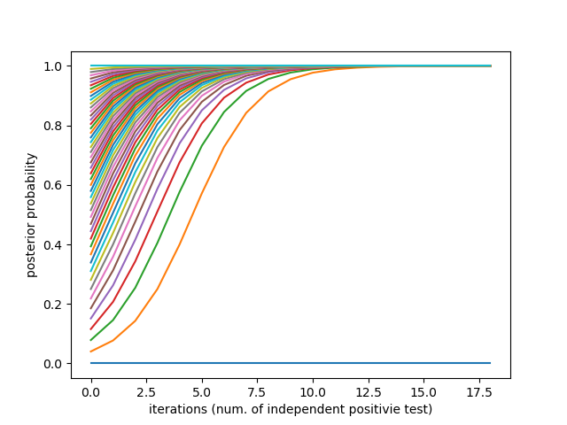
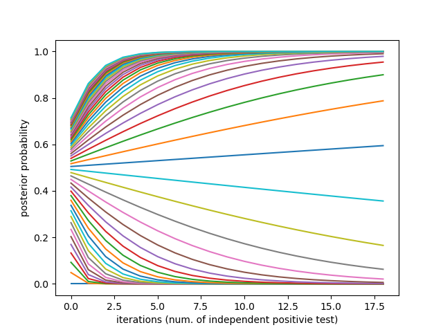
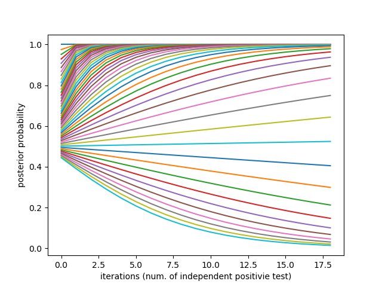

# Posterior update visualization
## Overview
This code visualizes the updates of posterior probability.
I was hoping to do a bifurcation analysis with this in near future. But it turns out that there is no any bifurcation.
## Plots

